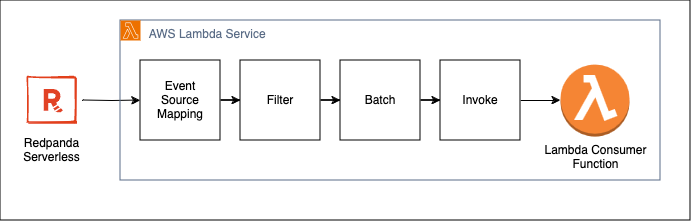
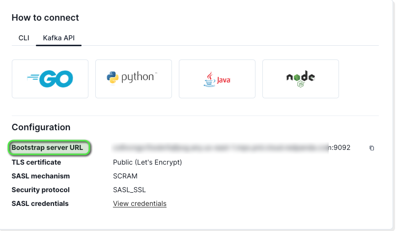
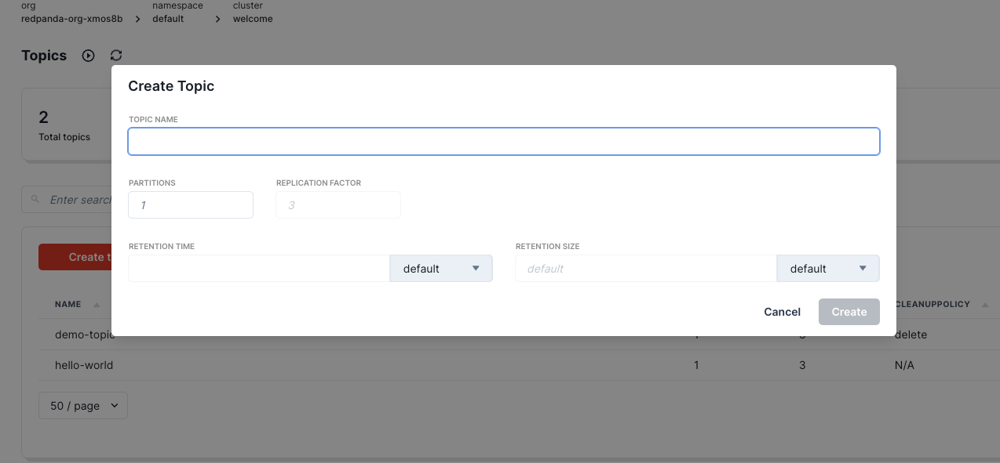
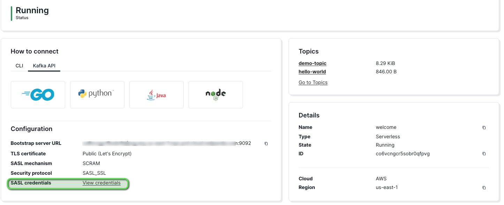
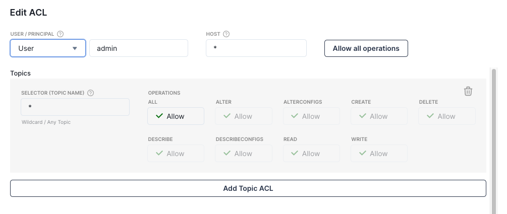

# Redpanda Integration with AWS Lambda

## Introduction

Redpanda is a simple, powerful, and cost-efficient streaming data platform that is compatible with Kafka APIs, and is used by many enterprise organizations across industries.

Customers have looked to us for guidance on using Redpanda as a Kafka alternative in AWS, and integrating it with various AWS services.

This guide shows how to setup a serverless Redpanda cluster and then how to integrate it with AWS Lambda using the existing Apache Kafka API trigger, which enables Lambda functions to easily be configured as consumers of the streaming data.

## Solution Overview

The integration consists of an serverless Redpanda cluster running in Redpanda cloud, as well as a Lambda function using the Apache Kafka trigger configured to receive data streaming events from Redpanda cluster. The Lambda function uses an internet gateway to connect to the publicly accessible Redpanda cluster. 

SASL SCRAM 256 is used for secure authentication between Lambda and Redpanda, and TLS is used for encryption in transit. AWS Secrets Manager securely stores the credentials.


We will walk through the steps to set up and deploy the serverless Redpanda cluster, and then use AWS SAM to deploy the remaining architecture.



 **** 
## Setting up a Working Environment

We will use an AWS Cloud9 instance as the working environment in the steps provided in this guide, however the included steps can also be used with Linux and MacOS.

In order to deploy a Cloud9 instance:

1. Log in to the AWS Console and navigate to the Cloud9 service.  
2. Click on “Create environment”.
3. Give the instance a name such as “RPLambdaIntergationWorkspace”.
4. Optionally specify a VPC and subnet for the instance to run in.
5. Accept the other defaults and click on “Create”.
6. The environment will take a few minutes to be created.  Once it has succeeded, click on “Open” to access the environment.

Once you have accessed your Cloud9 environment, we recommend clicking on the “+” next to the “Welcome” tab and choosing “New Terminal”.  This terminal gives you a larger window than the terminal automatically launched at the bottom of the screen, and will be used to run the commands in the following steps.

Depending on your account configuration, you may also need to export your AWS credentials in this terminal, such as AWS_ACCESS_KEY_ID, AWS_SECRET_ACCESS_KEY, and AWS_DEFAULT_REGION. “us-east-1” is used as the default region for these example steps.

## Prerequisites

The following prerequisites must be installed and configured in your working environment.

* [Create an AWS account](https://portal.aws.amazon.com/gp/aws/developer/registration/index.html) if you do not already have one and log in. The IAM user that you use must have sufficient permissions to make necessary AWS service calls and manage AWS resources.
* [AWS Serverless Application Model](https://docs.aws.amazon.com/serverless-application-model/latest/developerguide/serverless-sam-cli-install.html) (AWS SAM) installed
* [AWS CLI](https://docs.aws.amazon.com/cli/latest/userguide/install-cliv2.html) installed and configured
* [Git installed](https://git-scm.com/book/en/v2/Getting-Started-Installing-Git)

## Setting up the Redpanda Cluster

Serverless Redpanda cluster can be easily created from the Redpanda console. You can follow the Redpanda [documentation](https://cloud.redpanda.com/clusters/create) to get a cluster running within minutes. 

### Get bootstrap url
Once the cluster is running, get the bootstrap url. It will be available under Kafka API tab. Boostrap url will be used in configuring the Lambda function.


### Create a topic for consuming messages
Create a topic for sending and receiving messages. Click on the Go to topics link. It will open a page to create a new topic. Call it demo-topic and leave all the defaults. Topic name will be used in the Lambda function configuration.



### Create a user for connecting to the broker

Once the cluster is running, create a user by clicking on view credentials link.


Clicking on the link will open a Kafka access control page. Click on create user and it should open a page to create a user and password. You can call the user as admin and provide a strong password. This is the user and password that will be used to connect to the broker from the Lambda function. Next, click on the created user. It should open a Edit ACL page to assign access control to the user.


For this sample, click on Allow All Operations.

## Collecting Information Before Using SAM
 
We need to collect a few pieces of information before deploying our template. This includes the following:

* The boostrap url
* The topic name
* The username that Lambda will use to authenticate with Redpanda
* The password that Lambda will use to authenticate with Redpanda


Make sure that you have this information handy before proceeding.

## AWS SAM

The AWS SAM CLI is a serverless tool for building and testing Lambda applications. It uses Docker to locally test your functions in an Amazon Linux environment that resembles the Lambda execution environment. It can also emulate your application's build environment and API.
To use the AWS SAM CLI, you need the following tools.

* AWS SAM CLI - [Install the AWS SAM CLI](https://docs.aws.amazon.com/serverless-application-model/latest/developerguide/serverless-sam-cli-install.html)

During the deployment, you will be prompted to enter the information that we collected during the previous steps. We will use the SAM template to create and deploy the following:

* A basic Lambda function written in Python to receive events from the Redpanda cluster. This function logs the event as output.
* A Lambda Event Source Mapping (ESM) that links the Lambda function to the Redpanda cluster in order to receive events.
* An IAM Role for the Lambda function to use during execution. This includes reading from Secrets Manager, along with other necessary EC2 permissions for the ESM.
* An AWS Secrets Manager secret containing the username and password that the ESM will use to connect to Redpanda.

Make sure that you are in the working directory with the template.yaml file cloned from the repository, and then run the following command:

```
sam deploy -t template.yaml --guided --capabilities CAPABILITY_NAMED_IAM
```

During the guided deployment, you will be prompted to enter the parameters we have collected while setting up our Redpanda deployment. You will also need to specify a parameter prefix, which is a name that will be prepended on your Lambda function. Your input should look similar to the following (replacing the bootstrap URL with your actual bootstrap URL):

```
        Setting default arguments for 'sam deploy'
        =========================================
        Stack Name [sam-app]: 
        AWS Region [us-east-1]: 
        Parameter Prefix []: rpdemo
        Parameter BootStrapServerURL []: ************.***.*********.***.***.cloud.redpanda.com:9092
        Parameter TopicName []: hello-world
        Parameter UserName []: johndoe
        Parameter Password []: actualpasswordhere
        #Shows you resources changes to be deployed and require a 'Y' to initiate deploy
        Confirm changes before deploy [y/N]: 
        #SAM needs permission to be able to create roles to connect to the resources in your template
        Allow SAM CLI IAM role creation [Y/n]: 
        #Preserves the state of previously provisioned resources when an operation fails
        Disable rollback [y/N]: 
        Save arguments to configuration file [Y/n]: 
        SAM configuration file [samconfig.toml]: 
        SAM configuration environment [default]:  
```

After specifying the required parameter values, accept the defaults on the remaining questions and proceed to deploy the changeset.

## Testing

To test receiving an event, simply publish any data to the topic that the ESM was configured for. You can do this in the Redpanda Console by taking the following steps:

1. Navigate to your Redpanda console in your web browser and log in.
2. Click on "Topics"
3. Click on the topic name
4. Click on "Actions"
5. Click on "Produce Record" 
6. Fill in sample values for the key and value
7. Click on "Produce"

In order to see the test output, take the following steps:

1. Log in to the AWS console in your browser and navigate to Lambda (you can use the search field at the top of your console window to search for Lambda if needed).
2. Click on "Functions" and then click on the funcion name created by the previous steps.
3. Click on the “Monitor” tab in the resulting view.
4. Click on “View Cloudwatch logs”, and click on the most recent log stream under “Log streams”.  You should see events representing your Lambda function being called, and the debug output containing the contents of the events.

## Security Note - Input Validation

The intent of the solution outlined in this guide is to allow you to ingest data from topics in a Redpanda Serverless cluster. From a security perspective, it is always recommended to validate all inputs in your software. To read more about input validation, visit:

[OWASP C5: Validate All Inputs](https://owasp.org/www-project-proactive-controls/v3/en/c5-validate-inputs)

Input validation could be implemented in the sample Lambda function included in this template as the function consumes the events coming from the data stream. This would help protect your workload from unexpected data in the stream from any source.

As an example, the validation feature of Powertools for AWS Lambda could be used to assist in performing this validation:

[Powertools for AWS Lambda (Python)](https://docs.powertools.aws.dev/lambda/python/latest/utilities/validation/)

## Cleaning Up

To clean up the resources created during this guide, take the following steps:

1. Return to the console where you executed the "sam deploy" command.
2. Run the command "sam delete" and answer "y" to the prompt.
3. Please log in to the Redpanda console and delete the cluster to avoid incurring any additional charges.

## Conclusion

In this guide, you have learned how to enable integration between Lambda and Redpanda using event source mapping via the Kafka API interface. This allows you to easily use Lambda to consume data streams from your topics in Redpanda.

For more serverless learning resources, visit [Serverless Land](https://serverlessland.com/).

Find the Community Edition of Redpanda on Github here:
https://github.com/redpanda-data/redpanda

* * *
* * *

Copyright 2024 Amazon.com, Inc. or its affiliates. All Rights Reserved.


